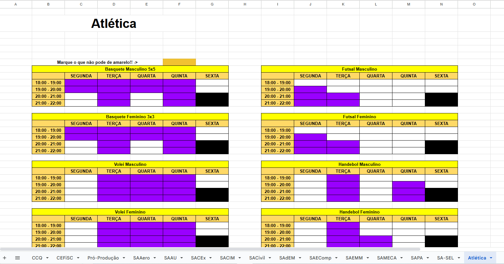

# Alocador de Jogos - Geração de Restrições via Google Planilhas

Este repositório contém um script em Google Apps Script que percorre as células coloridas de uma planilha do Google Sheets para gerar, automaticamente, código Python contendo as restrições de horários de diferentes secretarias acadêmicas e modalidades esportivas.

## 📋 Pré-requisitos

- Ter uma planilha do Google estruturada com:
  - Nome de cada aba igual ao nome da secretaria acadêmica.
  - Células com horários e dias organizados em uma grade.
  - Modalidades posicionadas nas células especificadas no script.
  - As células com **restrições de horário** devem estar **coloridas (diferentes de branco)**.

- Exemplo:

---

## 🚀 Como usar o script

1. Abra sua planilha no Google Sheets.
2. Vá em **Extensões > Apps Script**.
3. Cole o conteúdo do arquivo [`Gerar-Restricoes-Python.js`].
4. Salve o projeto.
5. Clique em `Executar > gerarRestricoesPython`.
6. Verifique seu Google Drive: um arquivo `.txt` será criado com o nome `restricoes_geradas_YYYY-MM-DD.txt`.
7. Copie o conteúdo gerado e use no seu código Python dentro da função `alocar_secretarias_academicas`.
8. No Código python voce pode adapta-lo para alocar o que for necessário (Nesse caso são jogos do intercurso do CAASO)

---